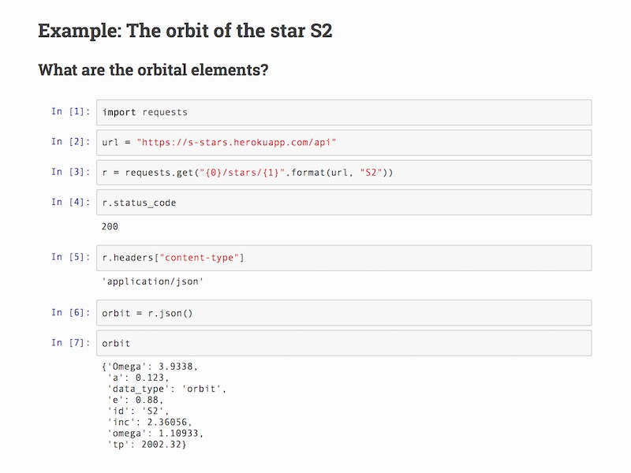

# Galactic Center Stellar Motion API

This web service can predict the exact position and velocities of many stars in the Galactic Center
at any particular time, based on the measurements by [Gillessen et al. (2009, ApJ 692/1075)](http://dx.doi.org/10.1088/0004-637X/692/2/1075).



### Local Install

Please make sure you are running Python 3:
```
python --version
```
1) Download the code:
```
git clone https://github.com/pmplewa/GC-StellarAPI
cd GC-StellarAPI
```
2) Install any missing required packages (newer versions might work too):
```
pip install -r requirements.txt
```
3) Start the web server:
```
python server.py
```
4) Point your web browser to this URL to access the documentation:
```
http://localhost:5000/
```

#### Documentation

To build the documentation, switch to the package directory and run:
```
make html
```
