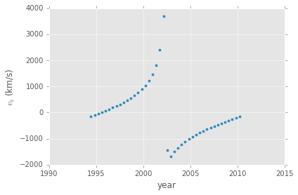

Galactic Center Stellar Motion API
==================================

.. toctree::
    :hidden:
    :caption: Documentation

    endpoints
    orbit_tools
    notes

This web service can predict the exact position and velocities of many stars in
the Galactic Center at any particular time, based on the measurements by
`Gillessen et al. (2009, ApJ 692/1075)
<http://dx.doi.org/10.1088/0004-637X/692/2/1075>`_. For a full list of available
features please refer to the list of :doc:`endpoints`.

Example: The orbit of the star S2
---------------------------------

What are the orbital elements?
~~~~~~~~~~~~~~~~~~~~~~~~~~~~~~

.. nbinput:: ipython3
    :execution-count: 1

    import requests

.. nbinput:: ipython3
    :execution-count: 2

    url = "http://localhost:5000/api"

.. nbinput:: ipython3
    :execution-count: 3

    r = requests.get(f"{url}/stars/S2")

.. nbinput:: ipython3
    :execution-count: 4

    r.status_code

.. nboutput::

    200

.. nbinput:: ipython3
    :execution-count: 5

    r.headers["content-type"]

.. nboutput::

    'application/json'

.. nbinput:: ipython3
    :execution-count: 6

    orbit = r.json()

.. nbinput:: ipython3
    :execution-count: 7

    orbit

.. nboutput::

    {'Omega': 3.9338, 'a': 0.123, 'data_type': 'orbit', 'e': 0.88, 'id': 'S2', 'inc': 2.36056, 'omega': 1.10933, 'tp': 2002.32}

What is the orbital period?
~~~~~~~~~~~~~~~~~~~~~~~~~~~

.. nbinput:: ipython3
    :execution-count: 8

    r = requests.get(f"{url}/period/S2")

.. nbinput:: ipython3
    :execution-count: 9

    json = r.json()
    period = json["period"]

.. nbinput:: ipython3
    :execution-count: 10

    period

.. nboutput::

    15.775327064662937

How does the orbit appear on-sky?
~~~~~~~~~~~~~~~~~~~~~~~~~~~~~~~~~

.. nbinput:: ipython3
    :execution-count: 11

    import numpy as np
    import pandas as pd

    %matplotlib inline
    import matplotlib
    matplotlib.style.use('ggplot')

.. nbinput:: ipython3
    :execution-count: 12

    t_min = orbit["tp"] - period / 2
    t_max = orbit["tp"] + period / 2
    t_val = np.linspace(t_min, t_max, 42)

.. nbinput:: ipython3
    :execution-count: 13

    data = pd.DataFrame([requests.get(f"{url}/stars/S2/{t}").json() for t in t_val])

.. nbinput:: ipython3
    :execution-count: 14

    data.head(3)

.. nboutput::

    +-+--+-------+--------+---------+---------+---------+---------+---------+
    | |id|t      | x      | y       | z       | vx      | vy      | vz      |
    +-+--+-------+--------+---------+---------+---------+---------+---------+
    |0|S2|1994.43|0.176991|-0.029967|-0.145768|-0.004997|-0.010638|-0.003880|
    |1|S2|1994.51|0.176581|-0.030808|-0.146064|-0.005331|-0.010581|-0.003604|
    |2|S2|1994.59|0.176145|-0.031645|-0.146339|-0.005665|-0.010522|-0.003327|
    +-+--+-------+--------+---------+---------+---------+---------+---------+

.. nbinput:: ipython3
    :execution-count: 15

    ax = data.plot(kind="scatter", x="y", y="x")
    ax.invert_xaxis()
    ax.set_aspect("equal")
    ax.set_xticks(np.arange(-0.1, 0.105, 0.05))
    ax.set_yticks(np.arange(-0.05, 0.205, 0.05))
    ax.set_xlabel(r"$\Delta\alpha\cos\delta$ (arcsec)")
    ax.set_ylabel(r"$\Delta\delta$ (arcsec)")

|

.. image:: _images/example_15.png
    :align: center
    :width: 300px

What about radial velocity?
~~~~~~~~~~~~~~~~~~~~~~~~~~~

.. nbinput:: ipython3
    :execution-count: 16

    def convert_velocity(value):
        params = {"from": "arcsec/yr", "to": "km/s"}
        r = requests.get(f"{url}/unit_convert/{value}", params=params)
        data = r.json()
        return data["result"]

.. nbinput:: ipython3
    :execution-count: 17

    data["vz_km/s"] = [convert_velocity(vz) for vz in data["vz"]]

.. nbinput:: ipython3
    :execution-count: 18

    ax = data.plot(kind="scatter", x="t", y="vz_km/s")
    ax.set_xlabel("year")
    ax.set_ylabel(r"$v_z$ (km/s)")

|

What are other names for S2?
~~~~~~~~~~~~~~~~~~~~~~~~~~~~

.. nbinput:: ipython3
    :execution-count: 19

    r = requests.get(f"{url}/names/S2")

.. nbinput:: ipython3
    :execution-count: 20

    r.json()

.. nboutput::

    {'id': 'S2', 'names': ['S0-2', 'S2']}
